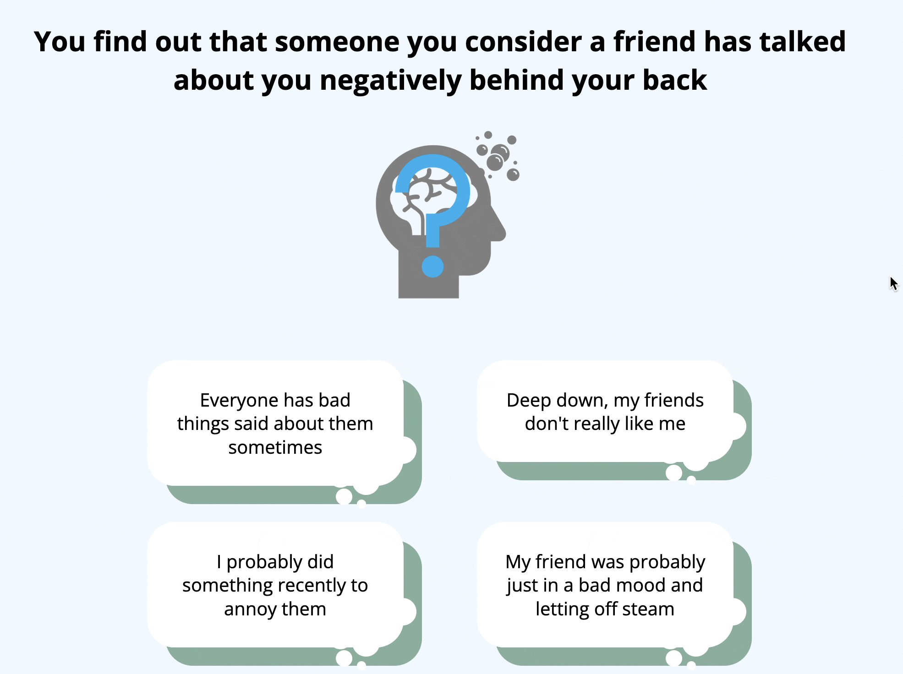
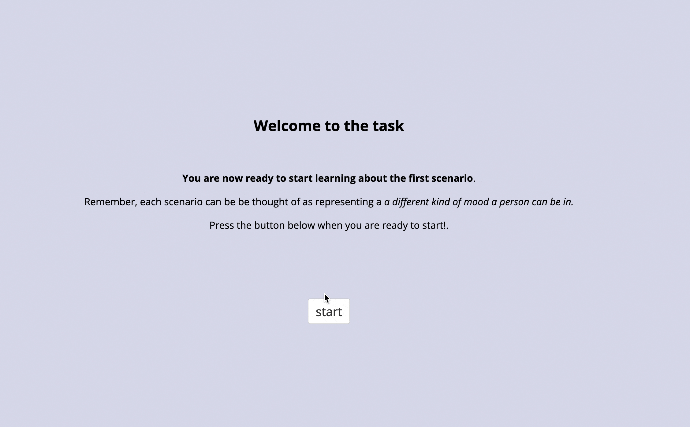
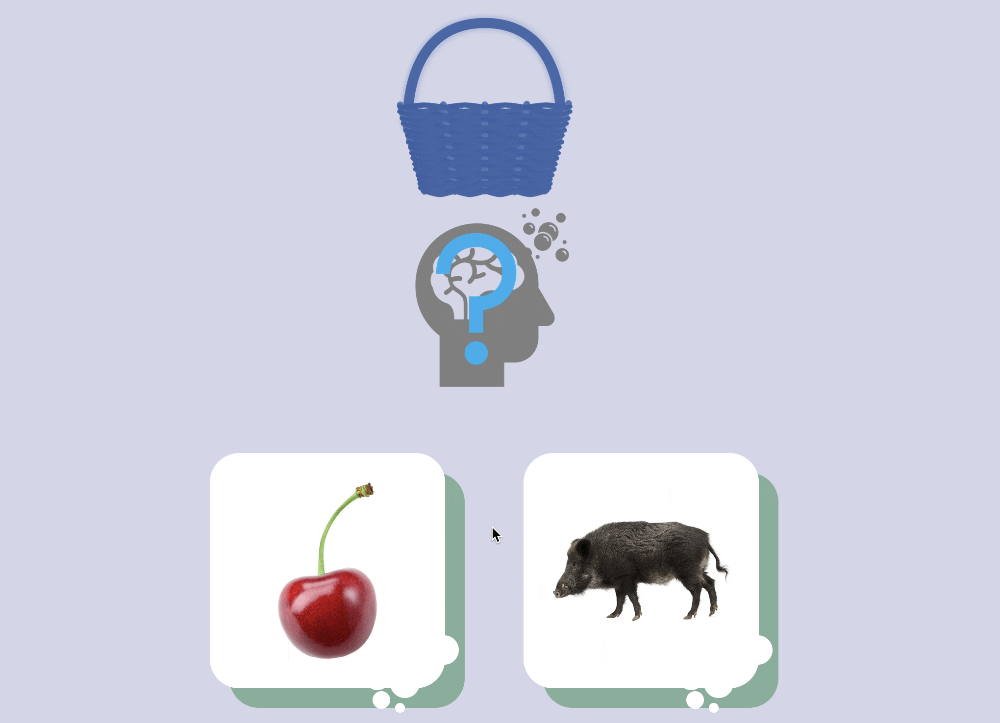

Code associated with the manuscript ["Learning training boosts causal attribution tendencies similarly to brief cognitive restructuring, depending on individual differences in learning rate"](https://osf.io/preprints/psyarxiv/fnez5).

Play a demo version of the causal attribution task (study 1 & 2) [here](https://modcomp-ca2.web.app/) (no data will be collected).

Learning training task (study 1 & 2):

Control learning task (study 2):

